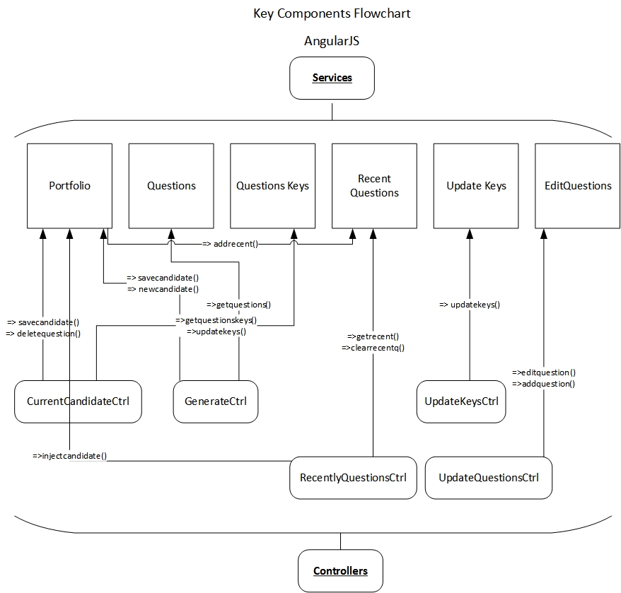

# Front-End
Services are singletons that **store state** and serve as the **models** for data. They interact with the backend.

Controllers bind service models to the data and contain helper methods for the views.

The key internal relationships of the Angular components are shown in the following diagram

- - -

### Services
- - -

**Portfolio Service**
* Serves as **the model** for the **current candidate**'s data.
* Controllers communicate with this service to add and remove questions or candidate info for the currently selected candidate.
* Communicates with other services to retrieve necessary data.

**Questions Service**
* Manages the **local model** for the question database. Stores every question.
* Stores every question.
* Performs transforms on questions as necessary.
* **Communicates with REST** interface on backend to retrieve questions.

**Questions Keys Service**
* Manages the **local model** for the questions keys.

**Recent Questions Service**
* Manages all the **previously generated** candidates.
* Exposes methods for deleting, and selecting previous candidates question portfolios.

**Update Keys Service**
* Interacts with REST backend to update the keys in the database.

**EditQuestions Service**
* Interacts with the REST backend to add/remove questions in the database.

On application load:

* Questions.getquestions() to load the questions from the database.

* QuestionsKeys.getquestionskeys() to load the keys from the database, which will be used to render views and structure the models for the questions.
